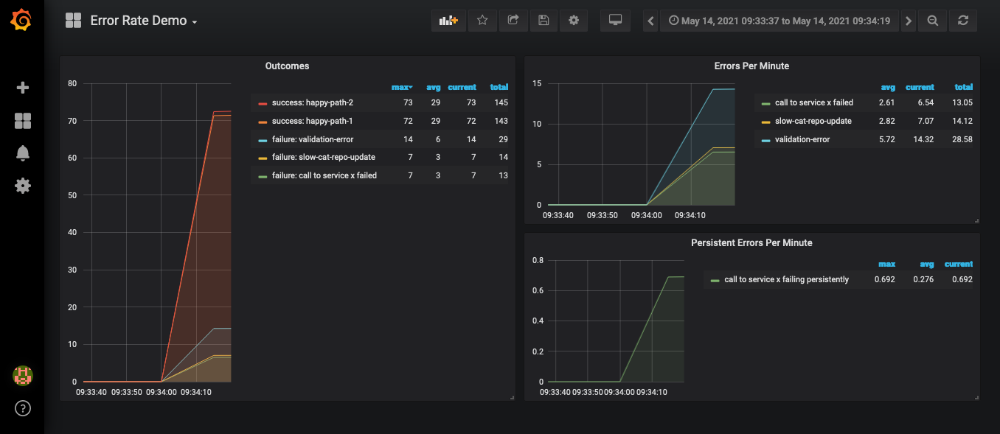

# Error Rate Demo

Proof of concept demo for metric observability and alerting on errors in a
[Spring Boot](https://spring.io/projects/spring-boot) service using
[Prometheus](https://prometheus.io), and [Grafana](https://grafana.com/).

## Requirements

- [JDK 11](https://docs.oracle.com/en/java/javase/11/)
- [Docker](https://www.docker.com/)

## Build

First build the spring boot application.

```bash
./gradlew build
```

Then build the docker images

```bash
docker compose build
```

## Run

```bash
docker compose up
```

After all services have started successfully, you can navigate to the following
URLs:

- [outcome-rate-demo Spring Boot service Prometheus endpoint](http://localhost:8080/actuator/prometheus)
- [Prometheus](http://localhost:9090/)
  - See the [pre-configured alerts](monitoring/prometheus/alerts.yml)
- [Grafana](http://localhost:3000/)
  - Username: `admin`
  - Password: `password`
  - See the pre-configured [Error Rate Demo dashboard](./monitoring/grafana/provisioning/dashboards/error-rate-demo.dashboard.json)

You can then run a simulation via a HTTP POST request

```bash
curl --location --request POST 'http://localhost:8080/simulate' \
--header 'Content-Type: application/json' \
--data-raw '{
    "iterations": 10000,
    "happyPathOdds": 1,
    "happyPath2Odds": 1,
    "validationErrorOdds": 1,
    "slowCatRepoUpdateOdds": 0.1,
    "callToXServiceFailedOdds": 0.09,
    "callToXServiceFailedPersistentlyOdds": 0.01
}'
```

If you prefer to use postman there is a collection in the [src/test/postman](./src/test/postman) directory.

## Example output after a simulation run

### Error Rate Demo prometheus endpoint

```plain
# HELP failure_total  
# TYPE failure_total counter
failure_total{cause="slow-cat-repo-update",persistent="n",} 331.0
failure_total{cause="validation-error",persistent="n",} 3131.0
failure_total{cause="call to service x failed",persistent="n",} 304.0
failure_total{cause="call to service x failing persistently",persistent="y",} 34.0
# HELP success_total  
# TYPE success_total counter
success_total{category="happy-path-2",} 3136.0
success_total{category="happy-path-1",} 3064.0
```

### Pre-configured Prometheus Alert


### Pre-configured Grafana Dashboard


